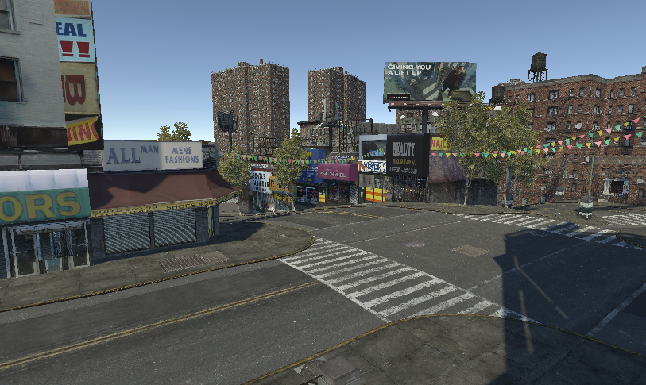

# GTA4Unity
 Open source reimplementation of GTA IV game engine in Unity

## Main Scene
 On main scene you will find the 'Loader' object, you can set your game direction there. Press play to start loading the map. Expect slow loading, even with multithread.

## Development
 World objects are loaded by the WorldComposerMachine class, initially it loads WPL instances, then IDE objects. Texture conversion from BGR to RGB currently happens on shader, check for: gta_default.shadergraph
