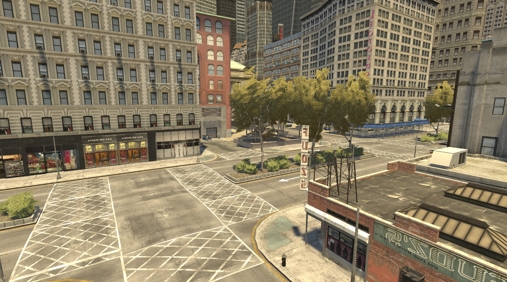
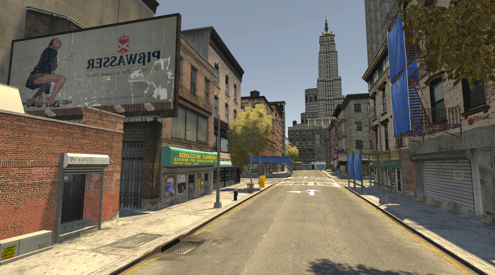
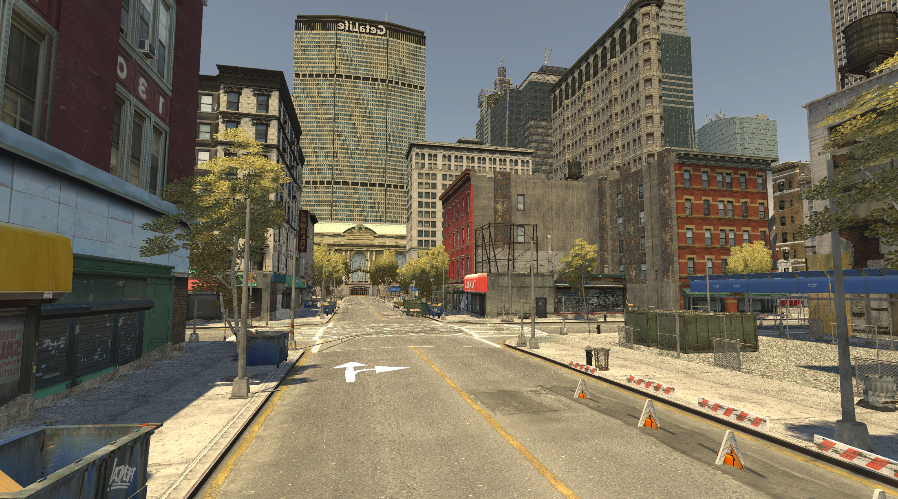
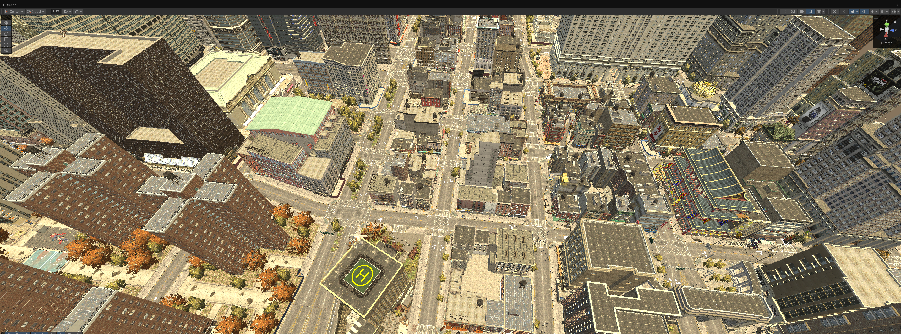
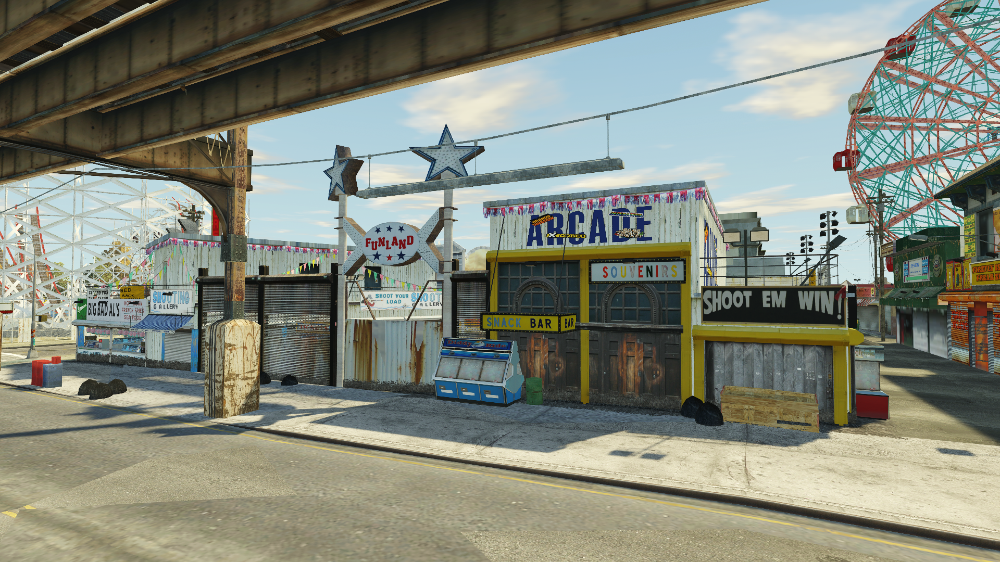

# GTA4Unity

Loads GTA IV's world into Unity 6. Reads the game's original files (IMG archives, WDR/WFT models, WTD textures, WPL/IPL placements, IDE definitions) and renders them using Unity's Entity Component System with Entities Graphics (BatchRendererGroup).

Requires a GTA IV installation — the project doesn't include any game assets.

## How it works

RageLib handles RAGE engine file format parsing. The world gets built through an ECS pipeline:

- **GTADatLoader** reads `gta.dat`, opens IMG archives, parses IDE/IPL/WPL files and water definitions
- **WorldEntityBaker** creates one ECS entity per world instance, indexed into spatial cells
- **CellActivationSystem** streams cells in/out based on camera distance
- **ModelLoader** parses models on worker threads with textures resolved through per-model TXD parent chains
- **MainThreadMeshUploadSystem** builds Unity meshes and materials, registers them with Entities Graphics
- **InstancePromotionSystem** spawns rendered children once a model finishes loading

Texture resolution uses a per-model parent chain: each model's IDE entry names a parent TXD, and the `txdp` IDE section defines TXD-to-TXD parent relationships. Lookups walk this chain using the pgDictionary hash table, so textures resolve the same way the original engine does.

## What's in here

- RageLib parser for WDR, WFT, WTD, WDD, WPL, IDE, IMG formats
- ECS streaming with cell-based activation and LRU eviction
- Ref-counted TXD store with IDE-driven parent chain
- Fragment support (WFT) with skeleton-based bone positioning
- Water mesh generation
- Procedural skybox (atmosphere scattering + layered clouds)
- Terrain blend shaders (2/3/4 layer with vertex color weights)

## Setup

1. Unity 6 (6000.4.0f1+), URP, Forward+
2. Clone and open in Unity Hub
3. Open the ECSWorld scene
4. Set `gameDir` on the ECSWorldBootstrap component to your GTA IV install path
5. Play

## Status

World geometry and textures load and stream correctly. This isn't a complete project yet — no physics, vehicles, peds, or gameplay.

## Requirements

- Windows
- GTA IV installed (Complete Edition, Steam, or EFLC)
- 8GB+ RAM
