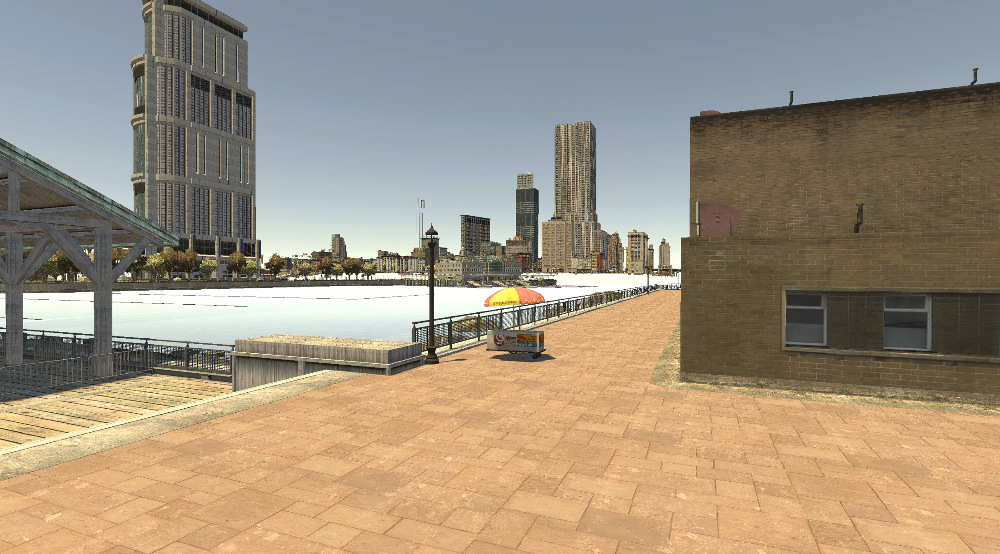

# GTA4Unity
Open source reimplementation of GTA IV game engine in Unity 6

## Features
- Full GTA IV world loading and rendering
- High-performance streaming system with multi-threaded loading
- Advanced material and texture sharing system
- Support for both GTA IV and Episodes from Liberty City (EFLC)
- Object pooling and spatial indexing for optimal performance
- Unity 6 with Universal Render Pipeline (URP)

## Requirements
- Unity 6 (6000.2.1f1 or later)
- GTA IV installation (retail, Steam, or EFLC)
- Windows (primary platform)
- 8GB+ RAM recommended

## Getting Started

### Setup
1. Clone this repository
2. Open the project in Unity Hub (ensure Unity 6 is installed)
3. Open the main scene in Unity
4. Find the 'Loader' GameObject in the hierarchy
5. Set the `gameDir` field to your GTA IV installation directory
6. Press Play to start loading the map

### Performance Notes
- Initial loading is optimized with multi-threading and caching
- World streaming happens dynamically based on player position
- Materials and textures are shared across all models for memory efficiency
- Embedded textures are properly handled to prevent missing textures

## Technical Details

### World Loading System
The **HighPerformanceLoader** provides:
- Multi-threaded loading with 8 parallel file workers
- Spatial grid indexing (100m cells) for O(1) proximity queries
- Priority-based loading queues (distance-based)
- Smart LRU caching with reference counting
- Object pooling to minimize GC pressure
- Batched GameObject spawning to reduce main thread overhead

### Material & Texture System
The **MaterialTextureResolver** ensures:
- All textures are pre-indexed during initialization
- Materials with the same texture share Unity materials
- Embedded textures remain accessible even when source models aren't loaded
- Case-insensitive matching handles naming inconsistencies

### Rendering
- Texture conversion from BGR to RGB happens in shader (gta_default.shadergraph)
- LOD system with 4 distance-based levels
- Unity's Universal Render Pipeline for modern rendering features

## Development
World streaming is managed by the HighPerformanceLoader class, which replaced the older WorldComposerMachine. The system loads WPL instances and IDE objects with intelligent caching and streaming based on player position.
